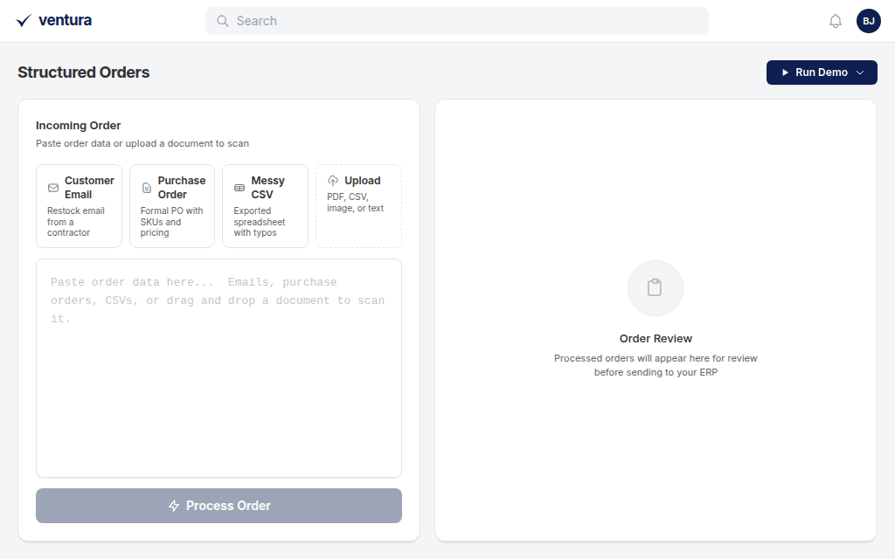
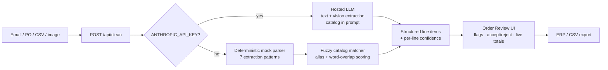

<div align="center">

# Clean Data — AI Order Entry Demo

**Turn messy customer orders — emails, POs, spreadsheets, even photos — into clean, catalog-matched line items ready for an ERP.**

Inspired by [Ventura](https://ventura.ai/) (YC W26): AI quoting and order entry for industrial distributors.




*The Edge Case demo: forwarded iMessage chaos → 20 structured line items → one flagged for review → sent to the ERP.*

</div>

## The problem

Industrial distributors run on inside sales teams whose day is re-typing orders into an ERP. The orders arrive as informal emails, faxed POs, exported spreadsheets full of typos, and photos of handwritten counter slips. Every line is a chance for a wrong SKU, a wrong quantity, or a lost hour.

This demo shows what the AI-native version of that workflow looks like, end to end: paste anything, get back structured line items matched against a live product catalog with per-line confidence — and a human-in-the-loop review step before anything touches the ERP.

## What it does

- **Parses anything** — free-form emails, formal purchase orders, messy CSVs, forwarded text messages, and (with an API key) photos of handwritten orders
- **Fuzzy-matches every line to a product catalog** — resolves abbreviations (`blk iron niples 3/4` → *Pipe Nipple 3/4" × 6" — Sch 40, Black Iron*), fixes typos, and honors exact SKUs
- **Scores its own confidence** — every match gets a 63–99% confidence band derived from word coverage and edit distance, shown as a per-row meter
- **Keeps a human in the loop** — unmatched items are flagged; the "Send to ERP" button stays locked until a person accepts or rejects each one, and totals recompute live
- **Shows the receipts** — hover any row to see the exact original text it was extracted from
- **Works with zero setup** — no API key needed; a deterministic mock parser powers the whole demo offline

## Try it in 60 seconds

```bash
git clone https://github.com/Ben-K-Jordan/Clean-Data.git
cd Clean-Data
npm install
npm run dev
```

Open [http://localhost:3000](http://localhost:3000), click **Run Demo**, and try the 💣 **Edge Case** — it types out a forwarded text-message order and parses it live.

**Optional AI mode** — add an API key to enable real LLM parsing and image scanning:

```bash
cp .env.example .env.local   # then set ANTHROPIC_API_KEY
```

## How it works



One API route, two interchangeable engines:

| Mode | When | Engine |
|---|---|---|
| **Mock** (default) | No API key | Deterministic pipeline: junk-line filtering → multi-item splitting → 7 regex extraction patterns → fuzzy catalog matching → Levenshtein-based confidence model |
| **AI** | `ANTHROPIC_API_KEY` set | Hosted LLM with the catalog in-prompt; handles text and images (handwritten orders) |

The mock mode isn't a stub — it's a real parsing pipeline that survives the same messy inputs, so the demo is fully interactive offline and the AI path is a drop-in upgrade.

## Things worth reading

| File | What's in it |
|---|---|
| [`lib/mock-clean.ts`](lib/mock-clean.ts) | The deterministic pipeline: junk-line detection (greetings, PO metadata, section headers), multi-item line splitting, seven ordered extraction patterns, and an insights pass that counts typos fixed and abbreviations resolved |
| [`lib/catalog.ts`](lib/catalog.ts) | 23-SKU industrial catalog (fasteners, pipe & fittings, valves, gaskets, bearings, safety, electrical, MRO) with alias-based fuzzy matching and word-overlap scoring |
| [`lib/samples.ts`](lib/samples.ts) | Four handcrafted worst-case inputs — every line verified end-to-end against the parser (the PO's line items sum exactly to its stated total) |
| [`lib/ai-clean.ts`](lib/ai-clean.ts) | The LLM integration: structured-JSON extraction with the catalog in-prompt, vision support, and defensive response validation |
| [`components/CleanedOutput.tsx`](components/CleanedOutput.tsx) | The review surface: animated stats, confidence meters, original-text tooltips, accept/reject flow with recomputed totals, CSV export |

## Sample data

| Sample | What it stresses |
|---|---|
| **Customer Email** | Informal contractor restock — bullet lists, "need about 300 of those", multiple items per sentence |
| **Purchase Order** | Formal plant PO — pipe-delimited rows, exact SKUs, prices, verified totals |
| **Messy CSV** | Exported spreadsheet — typos (`cuplings`, `safty`), abbreviations (`znc`, `blk`), missing `$` signs |
| **💣 Edge Case** | Forwarded iMessages — slang, section headers, mixed formats, and one item that isn't in the catalog at all (flagged for human review) |

## Tech stack

**Next.js 14** (App Router) · **TypeScript** · **Tailwind CSS** · optional **LLM integration** — no database, no state library, no component framework. The point is the data pipeline and the review UX, so the footprint stays small enough to read in one sitting.

---

*This is a personal demo project inspired by Ventura's product. It is not affiliated with, endorsed by, or built by Ventura — the Ventura name and mark belong to Ventura.*
